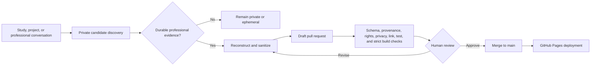

# Breezy Lynne — Systems, Identity & Automation

[](https://github.com/skrrtvonnegut-droid/portfolio/actions/workflows/portfolio.yml)

A living professional portfolio focused on Microsoft 365 administration, identity governance, endpoint management, automation, operational resilience, and technical knowledge design.

I work where systems, people, and process collide: reducing repetitive administration, making access and ownership visible, designing safer change paths, and converting tribal knowledge into operations that can survive handoffs, incidents, and growth.

> [!IMPORTANT]
> This repository is a **published evidence layer**, not a dump of workplace documents, Notion pages, or private conversations. Every artifact is reconstructed, generalized, attributed, checked for confidentiality, and reviewed through a pull request before publication.

## What this portfolio demonstrates

- **Identity and access governance:** least privilege, privileged-role workflows, lifecycle controls, ownership, and auditability.
- **Endpoint engineering:** staged deployment, update-ring design, enrollment, observability, rollback, and operational handoff.
- **Automation:** PowerShell, Microsoft Graph, repeatable reporting, and replacing fragile manual work with governed systems.
- **Service management:** incident learning, change controls, dependency mapping, problem prevention, and documentation quality.
- **Knowledge systems:** design documents, SOPs, runbooks, KB articles, templates, and AI-assisted authoring with human review.

## Featured open-source work

| Project | What it shows |
| --- | --- |
| [Microsoft 365 License Report](https://github.com/skrrtvonnegut-droid/M365LicenseReport) | PowerShell and Microsoft Graph reporting for license assignment, usage, cost analysis, and governance. |
| [Prompt Library](https://github.com/skrrtvonnegut-droid/prompt-library) | A versioned registry of prompts, skills, macros, schemas, validation, and CI for reusable AI-assisted workflows. |
| [The People’s Grimoire](https://github.com/skrrtvonnegut-droid/the-peoples-grimoire) | Open-source architecture for user-owned, policy-governed coordination across SaaS tools. |

## Initial artifact collection

| Domain | Artifact |
| --- | --- |
| Identity governance | [Privileged Role Activation with Microsoft Entra PIM](docs/artifacts/identity-governance/privileged-role-activation.md) |
| Endpoint management | [Staged Windows Update Rollout](docs/artifacts/endpoint-management/staged-windows-update-rollout.md) |
| Identity governance | [Service Account Registry and Review System](docs/artifacts/governance/service-account-registry.md) |
| Service management | [Mail-Flow Change After-Action Review](docs/artifacts/service-management/mail-flow-change-after-action.md) |
| Knowledge management | [Operational Documentation System](docs/artifacts/knowledge-management/operational-documentation-system.md) |

These are not verbatim employer procedures. They preserve the transferable problem-solving pattern—context, decisions, controls, trade-offs, validation, and outcomes—while omitting organization-specific implementation details.

## Publishing architecture



The discovery step can occur naturally during active ChatGPT work. Publication is intentionally review-gated: no automation may copy raw Notion pages, chat history, tickets, screenshots, or internal configuration into this public repository.

Read the full [Publishing and Artifact Standard](docs/methodology/publishing.md).

## Artifact contract

Artifact metadata has two public parts:

- Narrative metadata lives beside each document under `docs/artifacts/`.
- Provenance, authorship, publication rights, public slug, featured state, and review dates live in the `artifacts` register in `portfolio.yml`.

The validator merges both records by stable artifact ID and rejects missing, duplicate, conflicting, orphaned, or overdue entries. Private source mappings and approval state remain outside GitHub.

## Local validation and preview

```bash
python -m venv .venv
source .venv/bin/activate          # Windows: .venv\Scripts\activate
python -m pip install -r requirements-dev.txt
python scripts/portfolio.py validate
python scripts/portfolio.py review-dates
python scripts/portfolio.py links
ruff check scripts tests
python -m unittest discover -s tests
zensical build --clean --strict
python scripts/portfolio.py catalog --output site/catalog.json
zensical serve
```

Use `python scripts/portfolio.py links --external` when network access is available. Transient network failures are warnings; confirmed missing public pages block the check.

## Add an artifact

1. Register and review the candidate in the private portfolio control plane.
2. Start from [the artifact template](templates/ARTIFACT_TEMPLATE.md).
3. Place the reconstructed Markdown file under `docs/artifacts/<domain>/`.
4. Add its public governance record to `portfolio.yml`.
5. Run the validation, test, link, and strict-build commands above.
6. Open a draft pull request. Merge only after the privacy, provenance, rights, and technical-review checklist passes.

## Repository structure

```text
portfolio/
├── docs/                       # Zensical site sources and sanitized artifacts
│   ├── artifacts/              # Public professional evidence
│   ├── methodology/            # Publishing and review contract
│   └── stylesheets/            # Presentation overrides
├── templates/                  # Reusable artifact scaffolding
├── schema/                     # Merged metadata contract
├── scripts/                    # Validation, scanning, review, links, and catalog generation
├── tests/                      # Publication-boundary regression tests
├── portfolio.yml               # Profile, projects, and public artifact governance
├── zensical.toml               # Site, strict-link, and navigation configuration
└── .github/                    # CI/CD, maintenance, issue intake, and PR controls
```

## CI/CD controls

Pull requests run:

- schema and semantic metadata validation;
- private-reference and environment-specific denylist scanning;
- Gitleaks secret-history scanning;
- public review-date checks;
- external-link health checks;
- Ruff and unit tests;
- a strict Zensical build;
- deterministic machine-readable catalog generation.

Merge to `main` is the only deployment trigger. Monthly maintenance checks drift and opens an issue rather than silently rewriting authored content.

## Privacy boundary

Do not commit employer names, non-public people, email addresses, internal domains, tenant identifiers, server names, private links, IP addresses, ticket numbers, exact security configuration, customer or user data, credentials, certificates, screenshots of administrative portals, or copied proprietary documentation.

Removing names is not enough. A safe portfolio artifact is a **new generalized work** that teaches the system pattern without exposing the system it came from.

See [SECURITY.md](SECURITY.md) for reporting and response guidance.
