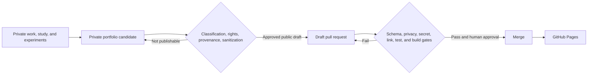

# Living Professional Portfolio

This repository is the public presentation and validation layer for Breezy Lynne’s living professional portfolio: systems administration, identity governance, endpoint engineering, automation, service management, and operational knowledge design.

> **Automatic accumulation; deliberate publication.**

Private professional evidence may become a portfolio candidate, but it does not become public merely because it is polished. Publication requires reconstruction, classification, provenance and rights review, automated checks, and human approval through a pull request.

## Published artifacts

| Capability | Artifact |
| --- | --- |
| Privileged access | [Privileged Role Activation with Microsoft Entra PIM](docs/artifacts/identity-governance/privileged-role-activation.md) |
| Endpoint change | [Staged Windows Update Rollout](docs/artifacts/endpoint-management/staged-windows-update-rollout.md) |
| Non-human identity governance | [Service Account Registry and Review System](docs/artifacts/governance/service-account-registry.md) |
| Incident and change learning | [Mail-Flow Change After-Action Review](docs/artifacts/service-management/mail-flow-change-after-action.md) |
| Knowledge architecture | [Operational Documentation System](docs/artifacts/knowledge-management/operational-documentation-system.md) |

These are reconstructed professional artifacts, not copied workplace documents. Organization names, production identifiers, private links, inventories, exact configuration, and source mappings remain outside the repository.

## Public projects

- [Microsoft 365 License Report](https://github.com/skrrtvonnegut-droid/M365LicenseReport)
- [Prompt Library](https://github.com/skrrtvonnegut-droid/prompt-library)
- [The People’s Grimoire](https://github.com/skrrtvonnegut-droid/the-peoples-grimoire)

Project cards will be added separately so each public repository remains canonical for its own implementation.

## Architecture



The private control plane retains evidence, source mappings, approval state, and sanitization notes. GitHub contains only public narrative artifacts, public governance metadata, validation code, and presentation assets.

Reconstructed narratives retain descriptive source disclosure in their front matter. Canonical public identity, provenance, rights, slugs, review dates, and presentation state live in [`data/artifacts.yml`](data/artifacts.yml). CI merges those two layers and validates the result against [`schemas/portfolio-artifact.schema.json`](schemas/portfolio-artifact.schema.json).

## Local development

```bash
python -m venv .venv
source .venv/bin/activate
pip install -e ".[dev]"
python scripts/run_checks.py
zensical serve
```

On Windows PowerShell:

```powershell
py -m venv .venv
.venv\Scripts\Activate.ps1
pip install -e ".[dev]"
python scripts/run_checks.py
zensical serve
```

## Publication controls

Pull requests validate:

- Artifact metadata, stable IDs, slugs, provenance, rights, and review dates
- Public content for private workspace links, identifiers, personal data, and private infrastructure patterns
- A repository-specific private denylist without exposing matched values
- Markdown structure, deterministic indexes, project metadata, and external links
- Python tooling, publication-boundary regression tests, and a strict Zensical build
- Repository history and common secret formats through Gitleaks

Merge to `main` is the only deployment trigger. Monthly maintenance checks review dates and link health, then opens an issue instead of silently rewriting authored content.

## Repository structure

```text
docs/        Public site content and reconstructed narratives
data/        Public governance and project metadata
schemas/     Public artifact contracts
templates/   Sanitized authoring templates
scripts/     Validation, indexing, and boundary controls
tests/       Publication-boundary regression tests
.github/     CI, deployment, maintenance, and contribution workflows
```

The full publication model is documented in the [methodology](docs/methodology/index.md). Suspected sensitive exposure should be reported privately as described in [SECURITY.md](SECURITY.md).
