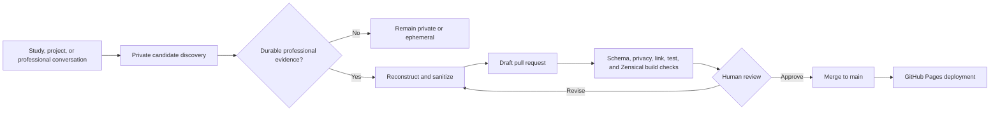

# Breezy Lynne — Systems, Identity & Automation

[](https://github.com/skrrtvonnegut-droid/portfolio/actions/workflows/portfolio.yml)

A living professional portfolio focused on Microsoft 365 administration, identity governance, endpoint management, automation, operational resilience, and technical knowledge design.

I work where systems, people, and process collide: reducing repetitive administration, making access and ownership visible, designing safer change paths, and converting tribal knowledge into operations that can survive handoffs, incidents, and growth.

> [!IMPORTANT]
> This repository is a **published evidence layer**, not a dump of workplace documents, Notion pages, or private conversations. Every artifact is reconstructed, generalized, checked for confidentiality, and reviewed through a pull request before publication.

## What this portfolio demonstrates

- **Identity and access governance:** least privilege, privileged-role workflows, lifecycle controls, ownership, and auditability.
- **Endpoint engineering:** staged deployment, update-ring design, enrollment, observability, rollback, and operational handoff.
- **Automation:** PowerShell, Microsoft Graph, repeatable reporting, and replacing fragile manual work with governed systems.
- **Service management:** incident learning, change controls, dependency mapping, problem prevention, and documentation quality.
- **Knowledge systems:** design documents, SOPs, runbooks, KB articles, templates, and AI-assisted authoring with human review.

## Featured open-source work

| Project | What it shows |
| --- | --- |
| [Microsoft 365 License Report](https://github.com/skrrtvonnegut-droid/M365LicenseReport) | PowerShell and Microsoft Graph reporting for license assignment, usage, cost analysis, and governance. |
| [Prompt Library](https://github.com/skrrtvonnegut-droid/prompt-library) | A versioned registry of prompts, skills, macros, schemas, validation, and CI for reusable AI-assisted workflows. |
| [The People’s Grimoire](https://github.com/skrrtvonnegut-droid/the-peoples-grimoire) | Open-source architecture for user-owned, policy-governed coordination across SaaS tools. |

## Initial artifact collection

| Domain | Artifact |
| --- | --- |
| Identity governance | [Privileged Role Activation with Microsoft Entra PIM](docs/artifacts/identity-governance/privileged-role-activation.md) |
| Endpoint management | [Staged Windows Update Rollout](docs/artifacts/endpoint-management/staged-windows-update-rollout.md) |
| Identity governance | [Service Account Registry and Review System](docs/artifacts/governance/service-account-registry.md) |
| Service management | [Mail-Flow Change After-Action Review](docs/artifacts/service-management/mail-flow-change-after-action.md) |
| Knowledge management | [Operational Documentation System](docs/artifacts/knowledge-management/operational-documentation-system.md) |

These are not verbatim employer procedures. They preserve the transferable problem-solving pattern—context, decisions, controls, trade-offs, validation, and outcomes—while omitting organization-specific implementation details.

## Publishing architecture



The discovery step can occur naturally during active ChatGPT work. Publication is intentionally review-gated: no automation may copy raw Notion pages, chat history, tickets, screenshots, or internal configuration into this public repository.

Read the full [Publishing and Artifact Standard](docs/methodology/publishing.md).

## Local validation and preview

```bash
python -m venv .venv
source .venv/bin/activate          # Windows: .venv\Scripts\activate
python -m pip install -r requirements.txt
python scripts/portfolio.py validate
python -m unittest discover -s tests
zensical build --clean
python scripts/portfolio.py catalog --output site/catalog.json
zensical serve
```

## Add an artifact

1. Start from [the artifact template](templates/ARTIFACT_TEMPLATE.md) or open a **Portfolio candidate** issue with public-safe metadata only.
2. Place the Markdown file under `docs/artifacts/<domain>/`.
3. Complete the YAML metadata block.
4. Run the validation, test, and build commands above.
5. Open a draft pull request. Merge only after the privacy, provenance, and source-rights checklist passes.

## Repository structure

```text
portfolio/
├── docs/                       # Zensical site sources and sanitized artifacts
│   ├── artifacts/              # Public professional evidence
│   ├── methodology/            # Publishing and review contract
│   └── stylesheets/            # Presentation overrides
├── templates/                  # Reusable artifact scaffolding
├── schema/                     # Machine-readable metadata validation
├── scripts/                    # Validation, privacy scanning, and catalog generation
├── tests/                      # Publication-boundary tests
├── portfolio.yml               # Profile and featured-project manifest
├── zensical.toml               # Site and navigation configuration
└── .github/                    # CI/CD, issue intake, and PR controls
```

## Privacy boundary

Do not commit employer names, non-public people, email addresses, internal domains, tenant identifiers, server names, private links, IP addresses, ticket numbers, exact security configuration, customer or user data, credentials, certificates, screenshots of administrative portals, or copied proprietary documentation.

Removing names is not enough. A safe portfolio artifact is a **new generalized work** that teaches the system pattern without exposing the system it came from.

See [SECURITY.md](SECURITY.md) for reporting and response guidance.
