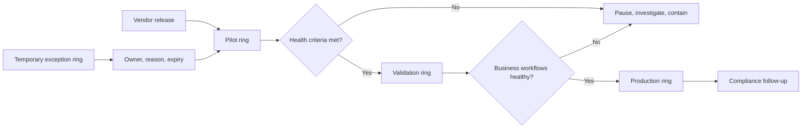

# Staged Windows Update Rollout

> **Portfolio note:** This design preserves the deployment logic and operational controls of a production rollout without publishing organization-specific policy names, assignment groups, device populations, deadlines, or configuration values.

## Context

Endpoint updates carry two competing risks:

- delaying updates leaves known vulnerabilities and support gaps in place;
- accelerating updates without staged validation can spread driver, application, or workflow failures across the fleet.

A reliable patching program does not choose one risk and ignore the other. It creates a controlled path from early exposure to broad deployment, with enough telemetry and ownership to stop when evidence changes.

## Desired outcome

Security and quality updates move through small, representative cohorts before reaching the broad device population. Each stage has clear entry criteria, observation time, success signals, pause conditions, and accountable owners. Exceptions are visible and temporary rather than quietly falling outside management.

## Deployment model

### Ring 1 — Pilot

A small set of IT-managed or technically capable devices receives updates first.

The cohort should be:

- small enough to limit impact;
- diverse enough to expose common hardware and application problems;
- actively observed rather than merely assigned;
- staffed by users who can report symptoms clearly.

### Ring 2 — Validation

A larger cross-section validates business workflows after the pilot is stable. Include representative hardware, network conditions, locations, and line-of-business applications without publishing those details in public documentation.

### Ring 3 — Production

The broad managed population receives the update after prior stages meet their exit criteria. Production should be the default destination for standard devices, not a group that requires continuous manual membership.

### Temporary exception ring

Exceptions may be necessary for a high-risk device, critical event, vendor dependency, or user-timed maintenance window. Every exception requires:

- a named owner;
- a documented reason;
- a compensating control when risk increases;
- an expiry or review date;
- a path back into the standard deployment model.

An exception ring must not become a permanent parking lot.

## Prerequisites

Before assigning a device to the rollout:

1. The device is supported, enrolled, and reporting to the endpoint-management service.
2. The user or device has the required licensing and assignment scope.
3. Inventory identifies operating-system version, hardware readiness, encryption state, security posture, and critical application dependencies.
4. Recovery keys and recovery procedures are available where applicable.
5. Monitoring can distinguish deployment failure from a device that simply has not checked in.
6. Service Desk and business support teams know the expected user experience and escalation path.

## Change design

### Separate quality and feature change

Monthly quality updates and major operating-system feature updates have different risk profiles. Manage them through related but distinct policies so a feature transition can pause without disrupting routine security patching.

### Use policy as the source of truth

Document intent in version-controlled design notes, but treat the endpoint-management platform as the authoritative source for the active setting. Export or review policy configuration during change preparation so documentation and production do not quietly diverge.

### Make assignment deterministic

Use mutually understood assignment logic:

- explicit inclusion for early rings;
- a broad default for production;
- explicit exclusion where policies would otherwise overlap;
- clear precedence for exception handling.

A device should not receive conflicting deployment intent because several groups happen to include it.

## Rollout procedure

### 1. Prepare the release

- Review vendor release information and known issues.
- Confirm application-owner readiness for critical workflows.
- Define observation windows and pause criteria.
- Confirm support coverage and communications.
- Record the current policy and assignment state for rollback comparison.

### 2. Deploy to pilot

Assign the pilot cohort and monitor:

- installation offer and download state;
- restart behavior;
- deployment errors;
- device health and security signals;
- application launch and core workflow tests;
- support contacts and user-reported symptoms.

Do not advance because the calendar says the pilot period ended. Advance because the evidence meets the exit criteria.

### 3. Evaluate the pilot

Proceed when:

- the expected proportion of active devices has installed successfully;
- no severe or repeating issue is linked to the update;
- critical workflows pass validation;
- restart and user-experience behavior match the change design;
- unresolved failures have owners and are understood well enough not to represent systemic risk.

Pause when there is an unexplained security regression, widespread installation error, boot or encryption issue, network loss, or failure of a critical application.

### 4. Deploy to validation

Expand to a representative business cohort. Repeat the technical checks and add workflow validation from people who perform real operational tasks.

### 5. Release to production

Move the broad population after validation succeeds. Communicate deadlines, restart expectations, and support channels. Continue monitoring rather than treating assignment as completion.

### 6. Remediate non-compliance

Classify devices that remain behind:

- offline or inactive;
- unsupported or not ready;
- policy conflict;
- insufficient storage or health;
- user deferral;
- deployment error;
- legitimate exception.

Each category requires a different response. A single “not compliant” queue hides the real work.

## Observability model

A useful operational dashboard separates:

- **coverage:** how many managed devices are in scope;
- **offer state:** whether policy reached the device;
- **installation state:** success, pending, failed, or unknown;
- **freshness:** when the device last checked in;
- **health:** encryption, security agent, restart, and post-update signals;
- **exceptions:** owner, reason, and expiry;
- **support impact:** incident volume and repeated symptoms.

Percentages should always include the denominator and observation window. “Ninety-five percent successful” means little if a large group of inactive devices was excluded without explanation.

## Containment and rollback

When pause criteria are met:

1. Stop progression to the next ring.
2. Preserve logs and identify the first affected cohort.
3. Determine whether the issue is update-specific, policy-specific, hardware-specific, or coincidental.
4. Apply the safest available containment: assignment removal, safeguard hold, vendor mitigation, configuration correction, or supported rollback.
5. Communicate affected scope and next decision point.
6. Test remediation in the smallest appropriate cohort before resuming.

Rollback is not always technically available or operationally safer. The change plan should distinguish true rollback from containment and forward remediation.

## Governance and review

Review the program at least after major releases and periodically for routine patching:

- Are pilot devices still representative and actively used?
- Have exceptions expired?
- Do policy names and documentation reflect current intent?
- Are deadlines producing healthy behavior or avoidable disruption?
- Are application owners participating before production exposure?
- Are unsupported devices entering a retirement path?
- Can the team explain why any managed device is outside the standard model?

## Trade-offs

- More rings reduce blast radius but increase administrative complexity and time-to-production.
- Aggressive deadlines improve currency but can disrupt operational windows.
- User flexibility improves experience but can produce indefinite deferral without enforcement.
- A broad default simplifies assignment but requires carefully designed exclusions.
- Telemetry improves decisions only when ownership and thresholds are explicit.

## What this demonstrates

- Designing endpoint change as a controlled service rather than a one-time policy deployment
- Combining Intune configuration, device readiness, communications, support handoff, and governance
- Using staged exposure and evidence-based gates to manage operational risk
- Separating policy intent, assignment logic, telemetry, and exception lifecycle
