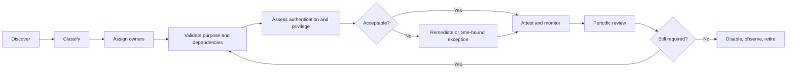

# Service Account Registry and Review System

> **Portfolio note:** This case study describes the governance model and implementation method. The production inventory that inspired it remains private and is not reproduced, summarized, or counted here.

## Context

Human identities usually have an understandable lifecycle: someone joins, changes roles, and eventually leaves. Non-human identities often do not. A service account may begin as a temporary integration credential, accumulate permissions as dependencies grow, survive several system owners, and remain enabled long after nobody can clearly explain what would break if it disappeared.

The technical risk is not only excessive privilege. It is **unknown purpose, unknown ownership, unknown dependency, and unknown retirement cost**.

## Desired outcome

Create a living registry that lets an organization answer, for every non-human identity:

- Why does it exist?
- What service or process depends on it?
- Who is accountable for its continued use?
- Where can it authenticate?
- What privilege and data can it reach?
- How is its credential protected and rotated?
- When was it last validated?
- What is the retirement or modernization path?

The registry is not the control by itself. It is the shared model that makes controls possible.

## Why a spreadsheet alone is not enough

A list of names and passwords-expire dates creates the appearance of governance while leaving the important questions unanswered. A useful registry links technical facts to accountability and lifecycle decisions.

The data model should be structured enough to report on risk, but small enough that owners will maintain it.

## Minimum data model

| Field | Purpose |
| --- | --- |
| Stable record ID | Preserves identity when display names or platforms change |
| Account or principal type | Distinguishes directory account, managed identity, application principal, local account, certificate identity, and other patterns |
| Business purpose | Explains the capability the identity enables in plain language |
| Dependent service or workflow | Identifies what may fail if the identity changes |
| Business owner | Accepts the operational need and risk |
| Technical custodian | Maintains configuration, authentication, and troubleshooting knowledge |
| Platform or trust boundary | Shows where the identity exists and authenticates |
| Authentication method | Password, certificate, workload identity, managed identity, key, or other mechanism |
| Interactive sign-in allowed | Highlights accounts that can be used like a person |
| Privilege classification | Records administrative, elevated, standard, or constrained access |
| Access summary | Describes major systems, roles, groups, or data classes without storing credentials |
| Credential custody | Records the approved secret store or key-management process |
| Rotation or expiry control | Captures mechanism, frequency, and accountable owner |
| Monitoring coverage | Shows whether sign-in and use are logged and alerted |
| Last evidence of use | Supports retirement decisions without equating “old” with “safe to delete” |
| Last attestation | Records when purpose, owner, access, and dependency were validated |
| Next review date | Creates an actionable governance cadence |
| Lifecycle state | Discovery, active, remediation, pending retirement, retired, or exception |
| Exception and expiry | Prevents risk acceptance from becoming permanent by omission |
| Modernization path | Tracks movement toward a safer identity pattern where feasible |

The registry should reference the secret-management location, never contain a secret.

## Lifecycle workflow

### 1. Discover

Use multiple sources because no single directory export proves complete coverage:

- directory and cloud identity inventories;
- privileged group and role assignments;
- scheduled tasks and service configurations;
- application registrations and enterprise applications;
- automation platforms and integration tools;
- password vault records;
- monitoring and sign-in evidence;
- infrastructure-as-code or deployment configuration;
- interviews with service and application owners.

Discovery produces candidates, not truth. A name that looks like a service account may belong to a person, and a human-looking identity may power a critical integration.

### 2. Classify

Normalize account type, authentication model, access level, and lifecycle. Controlled values make reporting possible; free-text notes preserve nuance that categories cannot hold.

Avoid a taxonomy so complicated that every reviewer chooses “other.” The model should support decisions, not display classification sophistication.

### 3. Assign ownership

Separate:

- **business ownership:** why the service remains necessary and what impact is accepted;
- **technical custody:** how the identity is configured, monitored, and recovered.

An owner must be a role or person with enough authority and context to make a decision. “IT” is not ownership.

### 4. Validate dependency

Ask what consumes the identity, how failure would appear, and how recovery would work. Where practical, link the identity to a service catalog entry, application record, runbook, or architecture diagram.

Unknown dependency raises risk even when privilege is low because teams may be unable to rotate or retire the credential safely.

### 5. Assess control quality

Evaluate:

- whether a non-secret workload identity could replace a stored credential;
- whether interactive sign-in can be blocked;
- whether privilege can be narrowed;
- whether credential rotation is automated and tested;
- whether usage is logged and anomalous activity is detectable;
- whether the account is excluded from controls without documented reason;
- whether recovery depends on one person’s memory.

### 6. Remediate or document an exception

Create work items for gaps. Every exception should state:

- the specific control that cannot currently be met;
- business and technical rationale;
- compensating controls;
- owner;
- risk decision;
- expiry or next review;
- modernization plan.

### 7. Attest

The owner confirms that purpose, dependency, access, and control statements remain accurate. Attestation should produce evidence and follow-up, not a checkbox detached from the underlying record.

### 8. Retire safely

Retirement is a controlled change:

1. Confirm recent usage and known dependencies.
2. Notify owners and define an observation window.
3. Disable or block authentication before deletion where supported.
4. Monitor for failure signals.
5. Remove assignments and credentials after confidence is established.
6. Preserve the retired record and decision history.

Immediate deletion may remove both the risk and the evidence needed to diagnose an outage.

## Risk prioritization

A lightweight score can help order work, but it should not replace judgment. Useful risk signals include:

- no accountable owner;
- high privilege;
- interactive sign-in;
- long-lived or manually managed credentials;
- external or internet-facing use;
- access to sensitive data;
- absent monitoring;
- stale or unknown usage;
- critical dependency with weak recovery documentation;
- control exclusions;
- failed or overdue attestation.

The registry should show *why* something is high risk, not only a number.

## Operational views

Different audiences need different views of the same underlying records:

- **Owner review:** accounts awaiting attestation or owner confirmation;
- **Security remediation:** high privilege, interactive sign-in, weak credential, and monitoring gaps;
- **Operations:** critical dependencies, rotation windows, and recovery documentation;
- **Modernization:** candidates for managed identity, certificate automation, or application redesign;
- **Lifecycle:** newly discovered, overdue, pending retirement, and exception-expiry queues;
- **Audit:** evidence of ownership, review, decisions, and completed remediation.

## Measures that matter

Useful measures include:

- percentage with validated business and technical owners;
- percentage with known dependency and recovery documentation;
- percentage using approved non-human authentication patterns;
- interactive sign-in exposure;
- overdue reviews and expired exceptions;
- reduction in permanent high privilege;
- accounts retired without unplanned service impact;
- average time from discovery to ownership and classification.

A shrinking inventory is not automatically success. Replacing one shared account with several unmanaged application secrets can make the number look better while increasing risk.

## Trade-offs and blind spots

- **Inventory creates maintenance work.** The answer is integration with existing lifecycle and change processes, not an annual cleanup marathon.
- **Owners may resist accountability.** Frame ownership as service continuity and decision authority, not administrative blame.
- **Last-used data can mislead.** Some identities run only during quarterly, annual, or disaster-recovery processes.
- **Rotation can cause outages.** Credential change needs dependency mapping, staged validation, and rollback.
- **Modern identity patterns are not universally available.** A time-bound exception with strong monitoring may be safer than an unsupported redesign.

## What this demonstrates

- Turning an ambiguous security problem into a maintainable governance system
- Designing a data model around decisions, ownership, and lifecycle rather than inventory for its own sake
- Connecting identity, service continuity, risk, documentation, and operational change
- Applying least privilege without ignoring legacy dependencies and recovery needs
