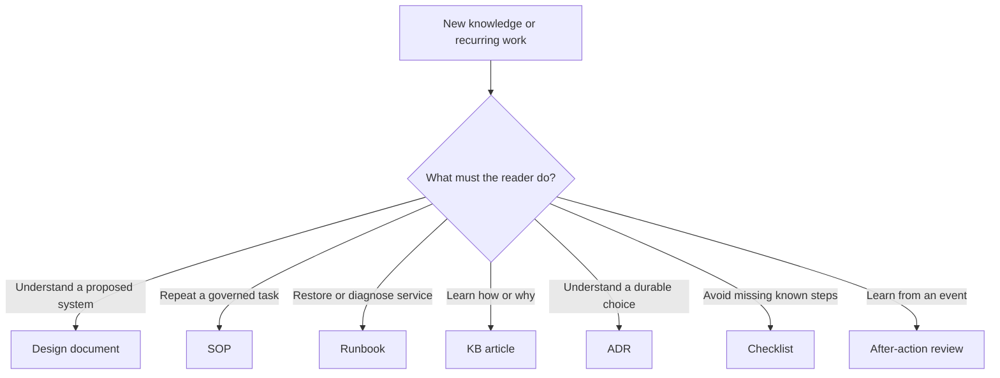

# Operational Documentation System

> **Portfolio note:** This artifact presents the system used to decide what kind of document should exist and how rough operational knowledge becomes governed, reviewable documentation.

## Context

Teams rarely suffer from a total absence of documentation. They suffer from a mixture of:

- old procedures with no owner;
- troubleshooting notes presented as authoritative runbooks;
- design decisions buried in chat;
- step lists that explain neither risk nor validation;
- long knowledge articles that cannot be used during an incident;
- several copies of the same instructions in different tools;
- documentation work that begins after memory has already faded.

The underlying problem is architectural: every piece of knowledge is treated as “a document,” even though different operational questions require different artifacts.

## Desired outcome

Create a documentation system in which a reader can quickly find:

- **what should be built and why;**
- **how a repeatable task is performed safely;**
- **how a degraded service is diagnosed and restored;**
- **how a system or concept works;**
- **what decision was made and what alternatives were rejected;**
- **what changed, who owns it, and when it must be reviewed.**

The system should make documentation easier to create during real work and easier to trust afterward.

## Artifact taxonomy

| Artifact | Primary question | Typical audience | Required strengths |
| --- | --- | --- | --- |
| Design document | What should exist, and why this design? | Engineers, owners, reviewers, change stakeholders | Requirements, architecture, controls, trade-offs, rollout, observability |
| Standard operating procedure | How is a controlled repeatable process performed? | Authorized operators | Scope, prerequisites, responsibilities, steps, validation, exceptions, review cadence |
| Runbook | How do we diagnose, contain, restore, and escalate? | On-call, Service Desk, operations | Symptoms, triage tree, safe actions, evidence, rollback, escalation, recovery verification |
| Knowledge-base article | How does this work, or how can a reader solve a bounded problem? | Audience-specific users or support staff | Clear explanation, conceptual model, examples, limitations, related resources |
| Architecture decision record | What decision was made, under what constraints, and with what consequences? | Future maintainers and reviewers | Context, options, decision, rationale, consequences, status |
| Checklist | What must not be forgotten during a known operation? | Practitioners already familiar with the process | Compact sequencing, stop conditions, sign-off |
| After-action review | What happened, why, and what will change? | Service owners, operations, leadership | Timeline, impact, cause, recovery, contributing conditions, actions, learning |

The taxonomy prevents a common failure: asking one document to be an architecture, training guide, emergency procedure, and audit record simultaneously.

## Routing decision

Several artifacts may emerge from one project, but each should have one dominant job. A design document may link to a deployment runbook; it should not silently become that runbook.

## Knowledge-capture pipeline

### 1. Capture during the work

Useful source material includes:

- change plans and implementation notes;
- incident timelines and diagnostic commands;
- chat decisions and unresolved questions;
- screenshots used temporarily for orientation;
- vendor documentation and public references;
- test results;
- stakeholder expectations;
- rollback decisions;
- post-change observations.

Raw capture is intentionally messy and often confidential. It is evidence, not the final artifact.

### 2. Identify the durable outcome

Ask:

- Will this happen again?
- Could another person perform or understand it from what exists?
- Did the work reveal a design decision or hidden dependency?
- Would failure to preserve this knowledge create avoidable risk?
- Is the knowledge stable enough to outlive the current ticket or conversation?

If not, leave it in the work record rather than manufacturing documentation debt.

### 3. Choose the canonical home

Each durable artifact has one authoritative location. Other tools link to it instead of maintaining silent copies.

The canonical system should support the artifact’s real needs:

- living operational knowledge may favor a knowledge platform with relationships and review properties;
- code, schemas, prompts, and reusable text that benefit from version history may favor Git;
- employer-confidential material remains in an employer-approved system;
- a public portfolio stores only intentionally reconstructed material.

### 4. Transform source into structure

Separate:

- observations from assumptions;
- current state from proposed state;
- procedure from explanation;
- required control from local convention;
- verified behavior from expected behavior;
- public reference from original analysis;
- reusable pattern from environment-specific value.

AI can accelerate this transformation, but it must not invent missing facts or weaken classification boundaries.

### 5. Review with the right people

Technical correctness is only one dimension. Depending on the artifact, review may need:

- an operator who will use it under pressure;
- a service owner who understands business impact;
- a security or compliance reviewer;
- a Service Desk reader at the intended comprehension level;
- an engineer who did not participate in the original work;
- an owner who can accept residual risk.

A document that works only for its author has not completed the handoff.

### 6. Publish, relate, and schedule review

Record:

- owner;
- lifecycle state;
- effective or last-reviewed date;
- next review trigger or cadence;
- source and provenance;
- related services, systems, decisions, and procedures;
- successor when superseded.

Publication is the start of lifecycle management, not the end of writing.

## Common metadata

A useful shared schema includes:

| Property | Why it matters |
| --- | --- |
| Stable artifact ID | Allows paths and titles to change without losing identity |
| Document type | Sets reader expectations and validation rules |
| Owner | Establishes accountability for accuracy and lifecycle |
| Audience | Controls assumed knowledge and language |
| Lifecycle | Distinguishes draft, active, review due, superseded, and archived material |
| Classification | Prevents convenience from overriding confidentiality |
| Domain or service | Improves discovery and relationships |
| Source and provenance | Separates original work, adapted work, and external reference |
| Last reviewed / review trigger | Makes staleness visible |
| Related artifacts | Connects design, operation, decision, and learning |

## Quality contract by document type

### Design document

Must include requirements, assumptions, dependencies, options, selected design, security and operations, deployment, rollback, observability, ownership, and unresolved questions.

### SOP

Must include purpose, scope, audience, prerequisites, responsibilities, controlled steps, validation, exception handling, evidence, escalation, and review cadence.

### Runbook

Must include symptoms, impact, safety warnings, triage sequence, evidence collection, recovery actions, stop conditions, rollback, escalation, and post-recovery validation.

### KB article

Must match the audience’s comprehension level, explain the underlying model, distinguish symptoms from causes, provide bounded steps or examples, state limitations, and link authoritative references.

### ADR

Must capture context, considered options, decision, rationale, consequences, status, and supersession relationships.

## AI-assisted authoring pattern

AI works best as a structured collaborator rather than an authority.

### Good uses

- classify the likely artifact type;
- organize rough notes;
- identify missing controls, owners, assumptions, or validation;
- rewrite for a specified audience;
- compare a draft against a quality contract;
- generate placeholders instead of guessing private values;
- extract decisions and open actions from a conversation;
- create a sanitized public derivative after explicit classification review.

### Unsafe uses

- inventing commands, permissions, owners, outcomes, or current product behavior;
- treating a polished draft as verified procedure;
- copying confidential inputs into public registries;
- summarizing away uncertainty that matters operationally;
- merging several source documents without preserving provenance;
- publishing screenshots or examples that contain production data.

### Human checkpoint

Before publication, a human confirms:

- technical accuracy;
- authorized scope;
- classification and source rights;
- audience fit;
- validation and rollback;
- ownership and lifecycle;
- whether the document can be followed by someone who was not present.

## Documentation as an operational control

Documentation creates value when it changes system behavior:

- a recurring incident becomes a tested recovery path;
- a hidden dependency becomes part of change planning;
- a privileged action becomes justified and auditable;
- an ownerless process gains accountable stewardship;
- a manual task becomes an automation candidate;
- a project decision remains understandable after team turnover;
- a Service Desk escalation becomes a resolvable first-line article;
- a workaround gains an expiry and replacement plan.

Page count is not a meaningful maturity measure. Reduced ambiguity, faster safe recovery, fewer repeated investigations, and stronger handoff are.

## Maintenance model

Review can be calendar-based or event-based.

### Calendar triggers

Use for stable but consequential procedures, access models, emergency steps, and audit controls.

### Event triggers

Review when:

- a platform, policy, owner, or architecture changes;
- a runbook fails during use;
- an incident reveals a missing dependency;
- a product interface or authentication model changes;
- a workaround becomes permanent;
- a linked document is superseded;
- the intended audience changes.

Event-based review often catches meaningful drift sooner than an annual reminder.

## Trade-offs

- More structure improves consistency but can discourage capture if every note requires full ceremony.
- Centralization improves discovery but can create a bottleneck if one person becomes the librarian for everyone.
- Templates improve completeness but can produce empty sections and false confidence.
- AI reduces drafting cost but increases the need for provenance, verification, and classification controls.
- Version history preserves decisions but cannot decide which system should be canonical.

The system should be strict at the publication boundary and lightweight during capture.

## What this demonstrates

- Treating documentation as service infrastructure rather than administrative residue
- Designing an artifact taxonomy around reader outcomes and operational use
- Connecting ITIL practices, knowledge management, version control, AI assistance, and privacy
- Building a path from lived work to institutional memory without maximizing capture for its own sake
