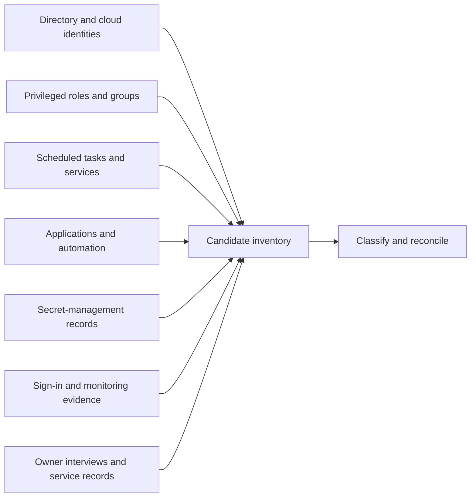
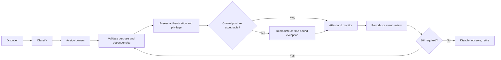

# Service Account Registry and Review System

> **Evidence boundary:** This case study preserves the governance model and reasoning from identity work without reproducing account names, owners, systems, exports, counts, screenshots, tenant data, or organization-specific inventory.

## Context

Human identities usually have an understandable lifecycle: someone joins, changes roles, and eventually leaves. Non-human identities often do not.

A service account may begin as a temporary integration credential, accumulate permissions as dependencies grow, survive several system owners, and remain enabled long after nobody can clearly explain what would break if it disappeared.

The risk is not only excessive privilege. It is the combination of **unknown purpose, unknown ownership, unknown dependency, and unknown retirement cost**.

## Problem

A flat inventory could show that accounts existed, but it could not support the decisions needed to govern them:

- Which identity enables which service?
- Who can accept the operational need and residual risk?
- Who actually knows how it authenticates and fails?
- Is interactive sign-in possible?
- Is access broader than the workload requires?
- Where is credential custody documented?
- Is rotation tested or merely scheduled?
- Can the identity be retired without causing an invisible outage?

The work therefore needed to become more than a cleanup list. It needed a lifecycle system connecting technical evidence to accountable decisions.

## Constraints

Several constraints shaped the design:

- No single directory export proves complete coverage.
- Names are unreliable indicators of whether an identity is human or non-human.
- Some identities run only during quarterly, annual, or recovery processes.
- Rotation and retirement can create outages when dependencies are poorly mapped.
- Legacy applications may not support modern workload identity patterns.
- Owners may understand the business process while technical custodians understand authentication and recovery.
- The registry must be maintainable enough to survive after the initial review campaign.

These constraints ruled out both “delete everything stale” and “collect every possible field before taking action.”

## Approach

### 1. Define the decisions first

The data model was designed around questions the organization needed to answer, not around every attribute that could be exported.

For each non-human identity, the registry should make visible:

- why it exists;
- what service or workflow depends on it;
- who owns the business need;
- who maintains the technical implementation;
- where it can authenticate;
- what privilege and data it can reach;
- how its credential is protected and rotated;
- whether use is monitored;
- when purpose and access were last attested;
- what the retirement or modernization path is.

The registry is not the control by itself. It is the shared model that allows ownership, review, remediation, and retirement controls to operate.

### 2. Establish a minimum viable data model

| Field | Decision supported |
| --- | --- |
| Stable record ID | Preserve identity when display names or platforms change |
| Principal type | Distinguish directory accounts, managed identities, application principals, certificates, local accounts, and other patterns |
| Business purpose | Explain the capability enabled in plain language |
| Dependent service or workflow | Identify what may fail if the identity changes |
| Business owner | Accept the continuing need and operational risk |
| Technical custodian | Maintain authentication, configuration, and recovery knowledge |
| Platform or trust boundary | Show where the identity exists and authenticates |
| Authentication method | Distinguish passwords, certificates, workload identities, managed identities, keys, and other mechanisms |
| Interactive sign-in allowed | Surface identities that can be used like a person |
| Privilege classification | Record administrative, elevated, standard, or constrained access |
| Access summary | Describe major roles, systems, and data classes without storing credentials |
| Credential custody | Reference the approved secret or key-management process |
| Rotation or expiry control | Record mechanism, cadence, test expectation, and owner |
| Monitoring coverage | Show whether sign-in and use are logged and alerted |
| Last evidence of use | Support investigation without treating inactivity as proof of safety |
| Last attestation | Record when purpose, owner, access, and dependency were validated |
| Next review date | Create an actionable governance queue |
| Lifecycle state | Distinguish discovery, active, remediation, exception, pending retirement, and retired |
| Exception and expiry | Prevent accepted risk from becoming permanent by omission |
| Modernization path | Track movement toward safer identity patterns where feasible |

The registry references credential-management locations; it never contains a credential.

### 3. Use multiple discovery paths

Discovery sources can include directory inventories, privileged assignments, scheduled tasks, service configurations, application registrations, automation platforms, secret-management records, monitoring evidence, infrastructure configuration, and owner interviews.

Each source produces candidates, not truth. A human-looking identity may power an integration, while an account with a service-like name may belong to a person.

### 4. Separate ownership from custody

The model distinguishes:

- **business ownership:** why the service remains necessary and what impact or risk is accepted;
- **technical custody:** how the identity is configured, monitored, rotated, and recovered.

This prevents “IT” from becoming a placeholder for accountability. It also avoids assigning business risk to the administrator who happens to know the password.

### 5. Validate dependency before remediation

For each identity, the review asks what consumes it, how failure would appear, and how recovery would work. Where practical, the record relates the identity to a service entry, application record, architecture, or runbook.

Unknown dependency raises risk even when privilege is low. Teams cannot rotate or retire an identity safely when they cannot observe what depends on it.

### 6. Assess control quality

The control review considers:

- whether a non-secret workload identity can replace a stored credential;
- whether interactive sign-in can be blocked;
- whether privilege can be narrowed;
- whether credential rotation is automated and tested;
- whether use is logged and anomalous behavior is detectable;
- whether control exclusions have a documented reason and expiry;
- whether recovery depends on one person’s memory.

Gaps become remediation work or explicit, time-bound exceptions.

### 7. Make exceptions operational

An exception records:

- the unmet control;
- business and technical rationale;
- compensating controls;
- accountable owner;
- risk decision;
- expiry or next review;
- modernization plan.

This turns “we cannot fix it yet” from an indefinite condition into governed work.

### 8. Attest and retire safely

Owners periodically confirm that purpose, dependency, access, and control statements remain accurate. Attestation produces evidence and follow-up rather than a checkbox detached from the underlying record.

Retirement is handled as a controlled change:

1. Confirm known dependencies and recent use.
2. Notify owners and define an observation window.
3. Disable or block authentication before deletion where supported.
4. Monitor for failure signals.
5. Remove assignments and credentials after confidence is established.
6. Preserve the retired record and decision history.

Immediate deletion may remove both the risk and the evidence needed to diagnose an outage.

## Lifecycle

The lifecycle makes the registry a queue of decisions instead of a static spreadsheet.

## Risk prioritization

A lightweight score can help order work, but the record should expose the reasons behind the score.

Useful risk signals include:

- no accountable owner;
- high privilege;
- interactive sign-in;
- long-lived or manually managed credentials;
- external or internet-facing use;
- access to sensitive data;
- absent monitoring;
- stale or unknown usage;
- critical dependency with weak recovery documentation;
- control exclusions;
- failed or overdue attestation.

A number without these underlying signals creates false precision.

## Operational views

Different audiences need different views of the same records:

- **Owner review:** identities awaiting attestation or owner confirmation
- **Security remediation:** privilege, interactive sign-in, credential, and monitoring gaps
- **Operations:** critical dependencies, rotation windows, and recovery documentation
- **Modernization:** candidates for managed identity, certificate automation, or application redesign
- **Lifecycle:** newly discovered, overdue, pending retirement, and exception-expiry queues
- **Audit:** evidence of ownership, review, decisions, and completed remediation

The views change; the canonical record does not.

## Validation and measures

The system is working when it improves decision quality and reduces unknowns. Useful measures include:

- proportion with validated business and technical owners;
- proportion with known dependency and recovery documentation;
- use of approved non-human authentication patterns;
- interactive sign-in exposure;
- overdue reviews and expired exceptions;
- permanent high-privilege exposure;
- identities retired without unplanned service impact;
- time from discovery to ownership and classification.

A shrinking inventory is not automatically success. Replacing one shared account with several unmanaged application secrets can make the count look better while increasing risk.

## Trade-offs and blind spots

- **Inventory creates maintenance work.** Integrate review with service lifecycle and change processes rather than relying on an annual cleanup campaign.
- **Owners may resist accountability.** Frame ownership as service continuity and decision authority, not administrative blame.
- **Last-used evidence can mislead.** Some identities run only during rare business or recovery events.
- **Rotation can cause outages.** Credential change requires dependency mapping, staged validation, observation, and rollback.
- **Modern identity patterns are not universal.** A time-bound exception with strong monitoring may be safer than an unsupported redesign.
- **A complete-looking registry can still be wrong.** Evidence quality and owner attestation matter more than field population.

## Outcome

The durable outcome is a governed identity lifecycle:

- unknown accounts become classified records;
- implicit ownership becomes explicit accountability;
- privilege and authentication choices become reviewable;
- exceptions gain compensating controls and expiry;
- retirement becomes observable change rather than deletion by guesswork;
- modernization candidates become visible without pretending every legacy dependency can be redesigned immediately.

## What this demonstrates

- Turning an ambiguous security problem into a maintainable governance system
- Designing a data model around decisions, ownership, and lifecycle rather than inventory for its own sake
- Connecting identity, service continuity, risk, documentation, and controlled change
- Applying least privilege without ignoring legacy dependencies and recovery needs
