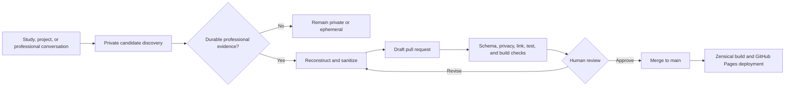

---
hide:
  - navigation
  - toc
---

# Breezy Lynne

## Systems, identity, automation, and operational knowledge

I am a Microsoft-focused Systems Administrator who works where systems, people, and process collide: reducing repetitive administration, making access and ownership visible, designing safer change paths, and converting tribal knowledge into operations that can survive handoffs, incidents, and growth.

!!! abstract "Automatic accumulation; deliberate publication"

    This is the **published evidence layer** of a larger professional knowledge system. Ongoing work, study, experimentation, and AI-assisted development may produce private portfolio candidates. Nothing moves here until it has been reconstructed, sanitized, validated, and reviewed through a pull request.

## What this portfolio demonstrates

### Identity and access governance

Least privilege, privileged-role workflows, non-human identity lifecycle, ownership, review cadence, and auditability.

### Endpoint engineering

Staged deployment, update-ring design, enrollment, telemetry, rollback criteria, exception handling, and operational handoff.

### Automation and Microsoft 365

PowerShell, Microsoft Graph, repeatable reporting, and the replacement of fragile manual work with governed systems.

### Service and knowledge management

Incident learning, change controls, dependency mapping, problem prevention, design documents, SOPs, runbooks, and audience-specific knowledge articles.

## Initial artifact collection

| Domain | Artifact | Capability demonstrated |
| --- | --- | --- |
| Identity governance | [Privileged Role Activation with Microsoft Entra PIM](artifacts/identity-governance/privileged-role-activation.md) | Turning least privilege into an operable, auditable workflow |
| Endpoint management | [Staged Windows Update Rollout](artifacts/endpoint-management/staged-windows-update-rollout.md) | Managing change blast radius with rings, evidence gates, and rollback criteria |
| Security governance | [Service Account Registry and Review System](artifacts/governance/service-account-registry.md) | Converting unknown non-human identities into owned lifecycle decisions |
| Service management | [Mail-Flow Change After-Action Review](artifacts/service-management/mail-flow-change-after-action.md) | Translating incident learning into dependency and change controls |
| Knowledge management | [Operational Documentation System](artifacts/knowledge-management/operational-documentation-system.md) | Designing documentation as operational infrastructure |

## Featured public projects

- **[Microsoft 365 License Report](https://github.com/skrrtvonnegut-droid/M365LicenseReport)** — PowerShell and Microsoft Graph reporting for license assignment, usage, cost analysis, and governance.
- **[Prompt Library](https://github.com/skrrtvonnegut-droid/prompt-library)** — A versioned registry of prompts, skills, macros, schemas, validation, and CI for reusable AI-assisted work.
- **[The People’s Grimoire](https://github.com/skrrtvonnegut-droid/the-peoples-grimoire)** — Open-source architecture for user-owned, policy-governed coordination across SaaS tools.

[Explore the project narratives](projects.md){ .md-button .md-button--primary }
[Read the publishing standard](methodology/publishing.md){ .md-button }

## The portfolio pipeline

The automation is intentionally asymmetric: candidate discovery may be proactive, but publication is never silent.
