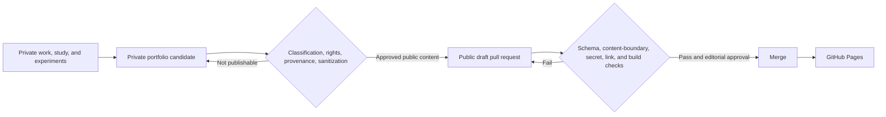

# Methodology

## Automatic accumulation; deliberate publication

Professional evidence begins in private working systems. Publication is a separate transition with explicit controls.

Because this repository is public, opening a branch or draft pull request here is already a public disclosure event. Confidentiality, source-rights, provenance, and contextual sanitization approval therefore happen in the private control plane **before** a public branch is created. Pull-request review provides a second editorial and technical gate; merge controls inclusion in the portfolio site, not initial visibility.

## Four planes

### 1. Private evidence

Private notes, work records, source relationships, and conversation history remain in their canonical systems. They may support a candidate, but they are never mirrored into this repository.

### 2. Private curation and approval

A candidate records what capability the work demonstrates, its source classification, provenance, publication rights, sanitization risk, and proposed public form. The fully reconstructed public text is reviewed privately. Only content in an explicitly approved state may be placed on a public branch or pull request.

### 3. Public artifact repository

This repository contains only sanitized content, public metadata, validation code, and presentation assets. Stable artifact IDs connect public artifacts to private records without exposing private source mappings. Draft branches and pull requests are public and must be treated as published disclosures even before merge.

### 4. Presentation

Zensical builds the Markdown corpus into a searchable site. The content contract remains renderer-neutral so presentation technology can change without changing artifact identity.

## CI/CD gates

Pull requests validate:

- Artifact front matter against a JSON Schema
- Stable IDs, slugs, provenance, rights, and review dates
- Public content for private references, identifiers, personal data, and suspicious paths
- Markdown structure and deterministic generated indexes
- Public project metadata
- External links and the strict site build
- Secrets through Gitleaks
- Regression tests for the publication boundary

Merge to `main` triggers a clean GitHub Pages build. Monthly maintenance checks stale review dates and link health, then opens a GitHub issue rather than silently rewriting authored content.

## Human authority

Automation may reject a public draft. It may not declare private work safe merely because no scanner matched it. Classification, contextual sanitization, rights review, and the decision to disclose happen before the public PR. Editorial approval and the decision to place the artifact on the deployed portfolio site happen before merge.

## Published methodology

### [Operational Documentation System](operational-documentation-system.md)

A practical architecture for deciding whether new knowledge should become a design document, SOP, runbook, knowledge article, decision record, checklist, or after-action review—and for governing that artifact through review and retirement.
