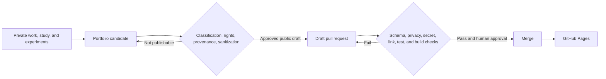

# Methodology

## Automatic accumulation; deliberate publication

Professional evidence begins in private working systems. Publication is a separate transition with explicit controls.

## Four planes

### 1. Private evidence

Private notes, work records, source relationships, and conversation history remain in their canonical systems. They may support a candidate, but they are never mirrored into this repository.

### 2. Private curation and approval

A candidate records what capability the work demonstrates, its source classification, provenance, publication rights, sanitization risk, proposed public form, and target path. Approval requires both a valid public draft and a deliberate state transition.

### 3. Public artifact repository

This repository contains only reconstructed content, public governance metadata, validation code, and presentation assets. Stable artifact IDs connect public artifacts to private records without exposing private source mappings.

Reconstructed narratives retain descriptive metadata and source disclosure beside the text. Canonical public identity, provenance, rights, domains, skills, slugs, featured state, and review dates live in `data/artifacts.yml`. The validator merges both layers into one schema-bound public record. Native future artifacts may declare the complete contract inline.

### 4. Presentation

Zensical builds the Markdown corpus into a searchable site. The content contract remains renderer-neutral so presentation technology can change without changing artifact identity.

## CI/CD gates

Pull requests validate:

- Canonical artifact metadata against a JSON Schema
- Stable IDs, slugs, provenance, rights, and review dates
- Registry coverage and agreement with narrative source IDs
- Public content for private references, identifiers, personal data, and suspicious paths
- A private repository denylist without exposing matched values
- Markdown structure and deterministic generated indexes
- Public project metadata and external links
- Secrets through Gitleaks
- Python tooling and publication-boundary regression tests
- A clean strict Zensical build

Merge to `main` triggers a GitHub Pages deployment. Monthly maintenance checks stale review dates and link health, then opens an issue rather than silently rewriting authored content.

## Sanitization is reconstruction

Removing names is not enough. A safe artifact is a new generalized work that preserves the transferable system:

- the problem and why it mattered;
- constraints and competing risks;
- design decisions and alternatives;
- validation, rollback, monitoring, and ownership;
- outcomes, limitations, and lessons.

It omits the source environment’s identities, exact topology, private links, inventories, production values, screenshots, logs, and operational breadcrumbs. A knowledgeable insider should not be able to reconstruct the source system from the remaining details.

## Human authority

Automation may reject a public draft. It may not declare private work safe merely because no scanner matched it. Classification, contextual sanitization, technical accuracy, evidentiary proportionality, and final publication remain human decisions.

## Published methodology

- [Operational Documentation System](../artifacts/knowledge-management/operational-documentation-system.md) — deciding whether knowledge belongs in a design document, SOP, runbook, knowledge article, postmortem, or decision record.
