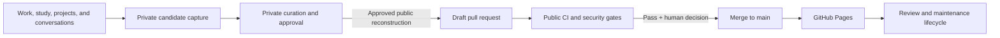

# Living Professional Portfolio Architecture

> **Portfolio note:** This artifact describes the architecture of the portfolio system itself. The private control plane is described structurally; workspace IDs, private URLs, source mappings, candidate contents, and personal or employer-confidential evidence are intentionally omitted.

## Problem

Professional evidence does not emerge in one clean system. It appears in technical conversations, private knowledge bases, source repositories, experiments, incident learning, study notes, and public projects. Some of that material is genuinely portfolio-worthy, but the same sources may contain employer-confidential configuration, private identities, operational breadcrumbs, copyrighted material, or personal context.

A naïve automation would solve the accumulation problem by creating a disclosure problem.

The architecture therefore starts from a different principle:

> **Automatic accumulation; deliberate publication.**

Automation may identify and stage evidence privately. Crossing into the public portfolio is a separate, reviewable state transition.

## Goals

The system is designed to:

- accumulate durable evidence from ongoing work and learning without requiring a one-time résumé project;
- preserve a strict membrane between private evidence and public artifacts;
- keep authorship, AI assistance, adaptation, and external references visible;
- reuse canonical public repositories instead of duplicating their code or documentation;
- publish only through pull requests with automated checks and human authority;
- keep the public content format renderer-neutral enough to survive presentation-layer changes;
- maintain review dates, stable artifact identity, and publication history over time.

It is explicitly not designed to mirror raw chats, private pages, tickets, screenshots, exports, logs, or production configuration into GitHub.

## Four planes



### 1. Private evidence

The source remains in the system where it belongs. Private work knowledge, personal context, employer-confidential records, and public repositories do not get flattened into one storage layer merely because they may support the same future artifact.

The source classification remains attached to the source. Processing a private record with AI does not make that record public.

### 2. Private curation and control

A private candidate record acts as the publication workflow rather than a replacement archive. It records the transferable capability, proposed public form, source relationships, classification, provenance, rights, sanitization risk, target path, review state, and eventual publication evidence.

The important distinction is that the candidate can reference sensitive evidence without requiring that evidence to enter the public repository.

A candidate may be rejected because it is duplicative, weak, unsafe, rights-restricted, or dependent on context that cannot be generalized without destroying its meaning.

### 3. Public artifact repository

The public GitHub repository contains reconstructed narratives, public governance metadata, validation tooling, presentation assets, and links to canonical public projects.

It does not contain the private source map.

Stable artifact IDs bridge the private and public records without exposing the underlying evidence graph.

### 4. Presentation and lifecycle

Zensical builds the Markdown corpus into a GitHub Pages site. The initial architecture considered Material for MkDocs, but the implementation moved to Zensical while preserving the more important decision: Markdown and structured metadata remain the canonical content layer rather than the renderer.

Published artifacts have review dates and can later be updated, superseded, or archived without losing their identity or history.

## Candidate lifecycle

A practical lifecycle is:

```text
Candidate → Sanitizing → Review → Approved → Exported → Published
                      ↘ Rejected
```

These states separate editorial progress from public visibility.

- **Candidate** means durable professional value has been identified privately.
- **Sanitizing** means the transferable artifact is being reconstructed.
- **Review** means a public-safe draft exists but still needs judgment.
- **Approved** means the public draft has explicit authorization to cross the membrane.
- **Exported** means a public branch or draft pull request exists.
- **Published** means the artifact has merged and the deployed public location is confirmed.
- **Rejected** preserves the audit trail for material that should not proceed.

Approval is intentionally human. A clean scanner result cannot decide that an employer-derived story is contextually safe or that a polished claim accurately represents personal contribution.

## Reconstruction instead of redaction

The architecture treats sanitization as authoring a new generalized work, not deleting names from an operational document.

A useful public artifact preserves:

- the problem and why it mattered;
- meaningful constraints and competing risks;
- decision logic and alternatives;
- validation, rollback, monitoring, and ownership;
- supported outcomes and remaining uncertainty;
- transferable lessons.

It removes or transforms:

- people, organizations, accounts, customers, and internal project names;
- tenant, object, application, device, ticket, and certificate identifiers;
- internal domains, hostnames, IP addresses, topology, and private links;
- screenshots, logs, exports, exact production values, and sensitive schedules;
- credentials and defensive details that reveal control gaps;
- proprietary or copyrighted source text.

The final question is contextual rather than syntactic: could a knowledgeable insider reconstruct the source environment from the combination of facts that remains?

## Public metadata contract

Every durable artifact has machine-checkable public metadata covering:

- stable ID and rendered slug;
- artifact kind;
- classification;
- authorship and provenance;
- professional domains and skills;
- publication rights and attribution state;
- review dates;
- featured state.

Reconstructed historical narratives retain descriptive source disclosure beside the text, while canonical public governance metadata is maintained separately and merged during validation. This lets the repository preserve older narrative structures without weakening the current public contract.

## CI/CD membrane

Pull requests run multiple independent gates because no single scanner is sufficient.

The public pipeline checks:

- schema and semantic metadata;
- stable IDs, slugs, registry coverage, provenance, rights, and review dates;
- Markdown structure and deterministic generated indexes;
- public project metadata and external links;
- generic private-reference and identifier patterns;
- a repository-specific private denylist whose matched values are withheld from logs;
- secret history through Gitleaks;
- Python tooling and publication-boundary regression tests;
- a clean strict Zensical build.

The default branch is protected by required pull requests and required quality/security checks. GitHub Pages deployment occurs after merge from the default branch, which keeps deployment separate from pre-merge validation.

## Private preflight

A second layer belongs outside the public repository: the private exporter.

Its job is to fail closed before a public branch exists. The preflight design requires an explicitly Approved candidate, a public-draft-ready state, resolved rights and classification, safe target path and slug, a hash match against the approved body, generic private-reference checks, and the private denylist.

The deterministic preflight deliberately has no GitHub or private-workspace write credentials. A separate orchestrator can perform the connector transaction only after a fresh successful preflight. This reduces the chance that a software bug can convert “validation logic” directly into an unintended public disclosure.

## Human authority and reversibility

The system automates the mechanical parts that are easy to forget:

- candidate capture;
- metadata completeness;
- duplicate detection;
- deterministic rendering;
- review dates;
- privacy and secret scanning;
- CI checks;
- deployment and maintenance signals.

It does not automate the decisions that require contextual responsibility:

- whether the user truly contributed the claimed work;
- whether a detail is recognizable to an insider;
- whether third-party material can be republished;
- whether uncertainty has been represented fairly;
- whether a public identity should intentionally be associated with the artifact.

Git history and pull requests provide reversibility for public changes, but reversal is not treated as a substitute for safe pre-publication review. Once a public branch exists, disclosure has already happened.

## Maintenance model

Published evidence can drift even when the prose remains unchanged. Product behavior changes, repositories move, links rot, and an artifact that was current six months ago may become misleading.

The portfolio therefore treats publication as the beginning of maintenance:

- every artifact has a next review date;
- scheduled maintenance checks stale reviews and public links;
- failures create visible follow-up work rather than silently rewriting authored content;
- public project cards point to canonical repositories instead of freezing copied implementation details;
- stable IDs allow artifacts to be updated or superseded without losing continuity.

## Trade-offs

### More control means more ceremony

The system intentionally introduces friction between private evidence and public identity. That friction is a feature at the disclosure boundary, but it would be harmful if imposed on every private note. Candidate capture is therefore lightweight; publication is strict.

### Automation can detect patterns, not meaning

A denylist can catch a company name. It cannot always determine that three otherwise harmless facts together identify a specific environment. Human contextual review remains necessary.

### Stable metadata creates maintenance obligations

Review dates, provenance, and rights fields improve trust only if they are maintained. Scheduled checks surface drift but cannot decide the correct revision.

### A living portfolio can become noisy

Automatic accumulation does not mean maximal accumulation. The candidate curator is expected to reject ordinary activity logs, weak evidence, and duplicate stories so the public body demonstrates judgment rather than volume.

## What this demonstrates

- Designing a CI/CD system around a privacy and classification boundary rather than only around code delivery
- Connecting knowledge management, Git workflows, provenance, rights, review lifecycle, and static-site publishing
- Separating deterministic validation from connector side effects
- Using stable identity to connect private evidence with public artifacts without exposing the evidence graph
- Treating AI as an orchestration and authoring aid while preserving human authority over claims and disclosure
- Building a portfolio as an operating system for professional evidence rather than a one-time résumé site

## Public evidence

The architecture began as a public [architecture review](https://github.com/skrrtvonnegut-droid/portfolio/issues/1) and is implemented in the [portfolio repository](https://github.com/skrrtvonnegut-droid/portfolio). The public repository remains the source of truth for the current schema, validation code, CI/CD workflows, and presentation layer.
